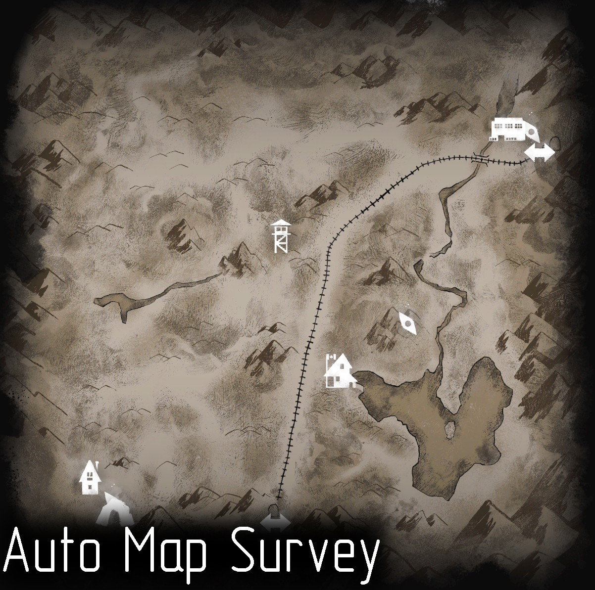

# AutoSurvey

Allows you to survey the map automatically.

You can change:

- Reveal map delay 
- Reveal map range multiplier

## Installation

You'll need [ModSettings](https://github.com/zeobviouslyfakeacc/ModSettings/releases). Place `AutoSurvey.dll` your `../Mods/` folder.

